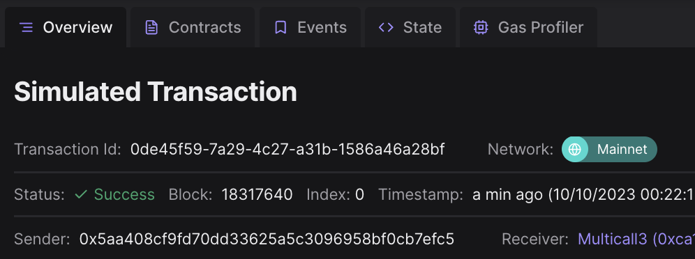
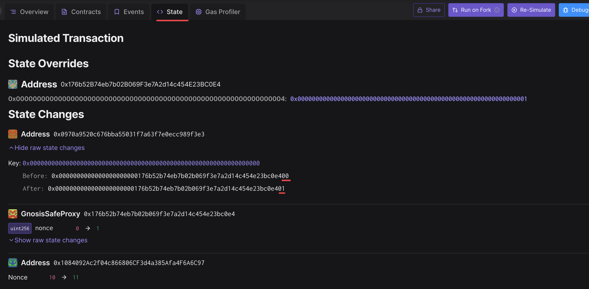

# OP Mainnet Pause

## Objective

This rehearsal is intended to generate pre-signed transactions
to pause OP Mainnet.

The call that will be executed by the Safe contract is defined in a
json file. This will be the standard approach for all transactions.

Note that no onchain actions will be taking place during this
signing. You won’t be submitting a transaction and your address
doesn’t even need to be funded. These are offchain signatures produced
with your wallet which will be collected by a Facilitator will execute
the contract, submitting all signatures for its execution.

Execution can be finalized by anyone once a threshold of signatures
are collected, so a Facilitator will do the final execution for
convenience.

## Approving the transaction

### 1. Install tools

```
just install
```

### 2. Setup Ledger

Your Ledger needs to be connected and unlocked. The Ethereum
application needs to be opened on Ledger with the message “Application
is ready”.

Check your address is correct by running the following command

```
eip712sign --address --hd-paths "m/44'/60'/0'/0/0" --ledger
```

You should see the output similar to the following:

```
Signer: 0x8C835568fE7Eea01B6DCD79214aB5BCe5E1759B0
``` 

If this is not the address you are expecting,
you can change the `hd-paths` parameter, i.e. `--hd-paths "m/44'/60'/1'/0/0"`.

### 3. Sign the transactions

We currently have 5 transactions to be signed inside the `tx` folder:
- `draft-86.json`
- `draft-unpause-87.json`
- `draft-88.json`
- `draft-89.json`
- `draft-90.json`

Copy them to `~/presigner/tx` folder.

You can sign them one by one by running the following commands:

```
cd ~/presigner

presigner \
        --json-file tx/draft-86.json \
        --ledger \
        --hd-paths "m/44'/60'/0'/0/0" \
        sign

presigner \
        --json-file tx/draft-unpause-87.json \
        --ledger \
        --hd-paths "m/44'/60'/0'/0/0" \
        sign

presigner \
        --json-file tx/draft-88.json \
        --ledger \
        --hd-paths "m/44'/60'/0'/0/0" \
        sign

presigner \
        --json-file tx/draft-89.json \
        --ledger \
        --hd-paths "m/44'/60'/0'/0/0" \
        sign

presigner \
        --json-file tx/draft-90.json \
        --ledger \
        --hd-paths "m/44'/60'/0'/0/0" \
        sign
```

For each transaction  we will be performing 3 validations
and ensure the domain hash and  message hash are the same
between the Tenderly simulation and your
Ledger:

1. Validate integrity of the simulation.
2. Validate correctness of the state diff.
3. Validate and extract domain hash and message hash to approve.

#### 3.1. Validate integrity of the simulation.

Make sure you are on the "Overview" tab of the tenderly simulation, to
validate integrity of the simulation, we need to

1. "Network": Check the network is Ethereum Mainnet.
2. "Timestamp": Check the simulation is performed on a block with a
   recent timestamp (i.e. close to when you run the script).
3. "Sender": Check the address shown is your signer account. If not,
   you will need to determine which “number” it is in the list of
   addresses on your ledger. 

Here is an example screenshot, note that the Timestamp and Sender
might be different in your simulation:



#### 3.2. Validate correctness of the state diff.

Now click on the "State" tab. Verify that:

1. Under address `0xbEb5Fc579115071764c7423A4f12eDde41f106Ed` (OptimismPortal contract),
   the storage key `0x0`'s value's last byte is changed from `0x00` to
   `0x01`. This is indicating that the `paused` variable
   is successfully changed from `false` to `true`.
2. There are no other significant state changes except for 2 nonce
   changes from the Safe and the signer address.
3. You will see a state override (not a state chagne). This is
   expected and its purpose is to generate a successful Safe execution
   simulation without collecting any signatures.

Here is an example screenshot. Note that the addresses may be
different:



#### 3.3. Extract the domain hash and the message hash to approve.

Now that we have verified the transaction performs the right
operation, we need to extract the domain hash and the message hash to
approve.

Go back to the "Overview" tab, and find the first
`GnosisSafe.domainSeparator` call. This call's return value will be
the domain hash that will show up in your Ledger.

Here is an example screenshot. Note that the hash value may be
different:


Right before the `GnosisSafe.domainSeparator` call, you will see a
call to `GnosisSafe.encodeTransactionData`. Its return value will be a
concatenation of `0x1901`, the domain hash, and the message hash:
`0x1901[domain hash][message hash]`.

Here is an example screenshot. Note that the hash value may be
different:


Note down both the domain hash and the message hash. You will need to
compare them with the ones displayed on the Ledger screen at signing.

### 4. Approve the signature on your ledger

Once the validations are done, approve the transaction in your Ledger.

> [!IMPORTANT] This is the most security critical part of the
> playbook: make sure the domain hash and message hash in the
> following two places match:

1. on your Ledger screen.
2. in the Tenderly simulation. You should use the same Tenderly
   simulation as the one you used to verify the state diffs, instead
   of opening the new one printed in the console.

There is no need to verify anything printed in the console. There is
no need to open the new Tenderly simulation link either.

After verification, sign the transaction. You will see the `Data`,
`Signer` and `Signature` printed in the console. Format should be
something like this:

```
Data:  <DATA>
Signer: <ADDRESS>
Signature: <SIGNATURE>
```

Double check the signer address is the right one.

### 5. Send the output to Facilitator(s)

Nothing has occurred onchain - these are offchain signatures which
will be collected by Facilitators for execution. Execution can occur
by anyone once a threshold of signatures are collected, so a
Facilitator will do the final execution for convenience.

You should now have 5 new files inside the `~/presigner/tx` folder similar to:
```
draft-86.signer-0x6964f301EdEBF16C563f97cE969C65ECdB39E918.json
draft-unpause-87.signer-0x6964f301EdEBF16C563f97cE969C65ECdB39E918.json
draft-88.signer-0x6964f301EdEBF16C563f97cE969C65ECdB39E918.json
draft-89.signer-0x6964f301EdEBF16C563f97cE969C65ECdB39E918.json
draft-90.signer-0x6964f301EdEBF16C563f97cE969C65ECdB39E918.json
```

Share these 5 files with the Facilitator, and
congrats, you are done!
