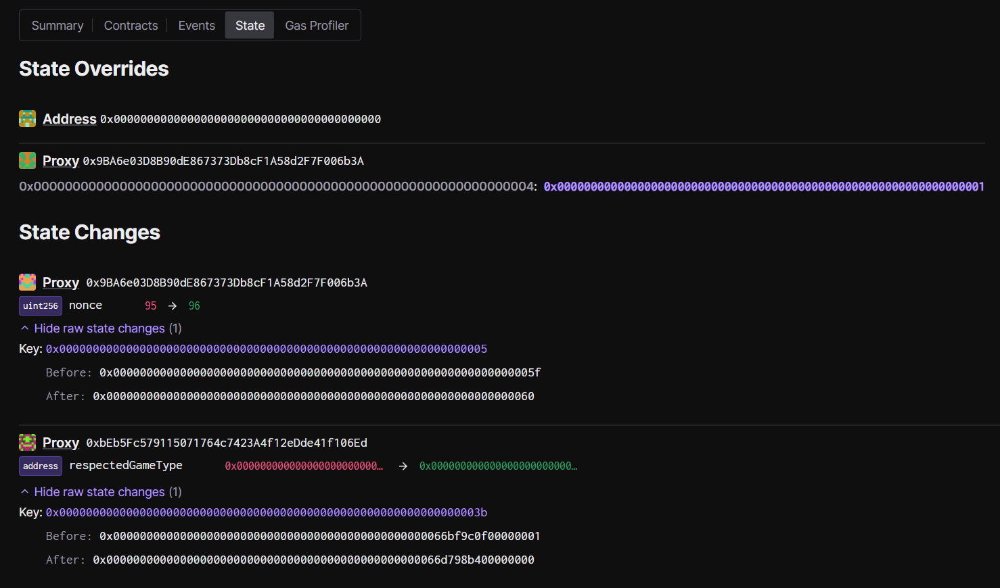

# Deputy Guardian - Reset back to permissionless Cannon `FaultDisputeGame`

Status: DRAFT, NOT READY TO SIGN

## Objective

This batch updates the `respectedGameType` to `CANNON` in the `OptimismPortalProxy`. This action requires all in-progress withdrawals to be re-proven against a new permissionless Cannon `FaultDisputeGame` that was created after this update occurs.

The batch will be executed on chain ID `1`, and contains `1` transactions.

## Simulation

Please see the "Simulating and Verifying the Transaction" instructions in [SINGLE.md](../../../SINGLE.md).

When simulating, ensure the logs say `Using script /your/path/to/superchain-ops/tasks/eth/018-permissioneless-game-type/SignFromJson.s.sol`. This ensures all safety checks are run. If the default `SignFromJson.s.sol` script is shown (without the full path), something is wrong and the safety checks will not run.

Do NOT yet proceed to the "Execute the Transaction" section.

### State Validations

The two state modifications that are made by this action are:

1. An update to the nonce of the Gnosis safe owner of the `DeputyGuardianModule`.
2. An update to the shared slot between the `respectedGameType` and `respectedGameTypeUpdatedAt` variables.

The state changes should look something like this:



Slot [`0x000000000000000000000000000000000000000000000000000000000000003b`](https://github.com/ethereum-optimism/optimism/blob/op-contracts/v1.4.0-rc.4/packages/contracts-bedrock/snapshots/storageLayout/OptimismPortal2.json#L100C3-L113C5) in the `OptimismPortalProxy` has the following packed layout:

| Offset     | Description                                                  |
| ---------- | ------------------------------------------------------------ |
| `[0, 20)`  | Unused; Should be zero'd out.                                |
| `[20, 28)` | `respectedGameTypeUpdatedAt` timestamp (64 bits, big-endian) |
| `[28, 32)` | `respectedGameType` (32 bits, big-endian)                    |

Note that the offsets in the above table refer to the slot value's big-endian representation. You can compute the offset values with chisel:
```
➜ uint256 x = 0x00000000000000000000000000000000000000000000000066bb70d200000001
➜ uint64 respectedGameTypeUpdatedAt = uint64(x >> 32)
➜ respectedGameTypeUpdatedAt
Type: uint64
├ Hex: 0x
├ Hex (full word): 0x66bb70d2
└ Decimal: 1723560146
➜ uint32 respectedGameType = uint32(x & 0xFFFFFFFF)
➜ respectedGameType
Type: uint32
├ Hex: 0x
├ Hex (full word): 0x1
└ Decimal: 1
```

To verify the diff:

1. Check that the only modification to state belongs to the `OptimismPortalProxy` at slot `0x000000000000000000000000000000000000000000000000000000000000003b`
1. Check that the lower 4 bytes equal `0` (`CANNON`) when read as a big-endian 32-bit uint.
1. Check that bytes `[20, 28]` equal the timestamp of the transaction's submission when read as a big-endian 64-bit uint.

## Execution

At this point you may resume following the execution instructions in the "Execute the Transaction" section of [SINGLE.md](../../../SINGLE.md).

When executing, ensure the logs say `Using script /your/path/to/superchain-ops/tasks/eth/018-permissionless-game-type/SignFromJson.s.sol`. This ensures all safety checks are run. If the default `SignFromJson.s.sol` script is shown (without the full path), something is wrong and the safety checks will not run.
